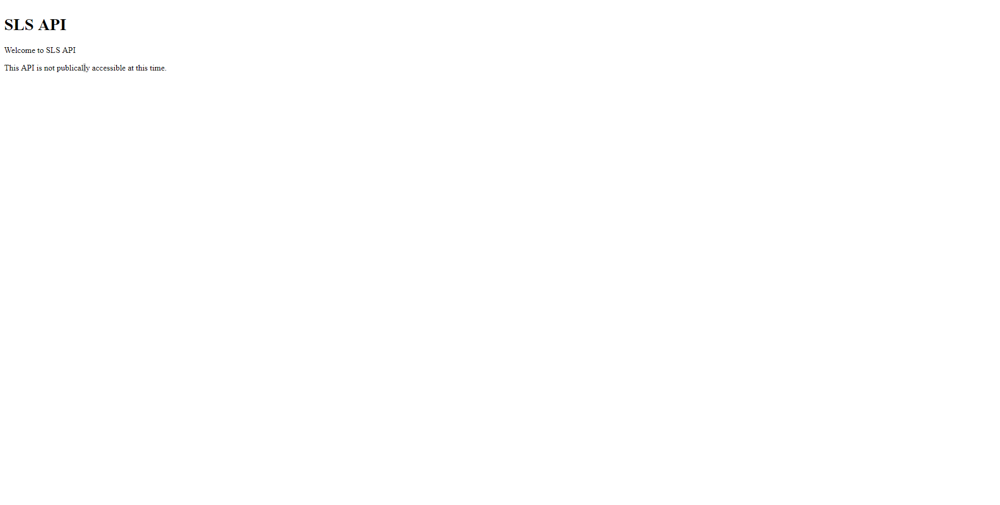
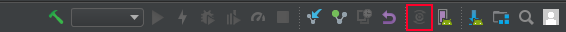
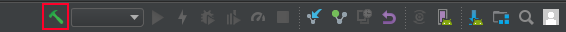
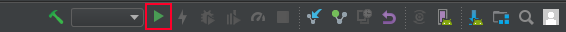

# Strex Lead System

A lead management system developed as part of the ITSP200 project for BsC IT degree.

## Table of content

- [Setup](#setup)
    - [API](#api)
        - [Database](#database)
        - [Node](#node)
    - [Android](#android)

## Setup

### API

#### Database

1. Download and install mySQL ([Download here](https://dev.mysql.com/downloads/installer/))
2. Create a new user and call it sls_test and give it all admin permisions and make the password 'password'
3. Create a new database called sls_development

#### Node

1. Download and install Node.JS ([Download here](https://nodejs.org/en/download/))
2. (Optional) Install sequalize-cli `npm install -g sequelize-cli`
3. Open command prompt (WinKey+R cmd) and navigate to where sls-api is located (eg. cd C:/dev/sls/sls-api)
4. Enter `npm update` and wait
5. Start the server `npm start`

Goto http://loclahost:3000/v1/ and you should see this page

### Android

1. Download and install Android Studio ([Download here](https://developer.android.com/studio/))
2. Open the project (`sls-android`)
3. (Optional) if this is the first time opening a project in Android Studio, you need to download the build tools. There will be a link in the console, click it and follow the steps
4. Sync the project (Toolbar top right)

5. Build the project

6. Make sure your phone is connected via USB and USB debug mode is enabled ([Read how to do that here](https://www.kingoapp.com/root-tutorials/how-to-enable-usb-debugging-mode-on-android.htm))
7. Run the project

8. Click OK on the popup displayed on your phone

9. In Android Studio select OK to run the app

>To make running the app easier in the future make sure the checkbox is selected
